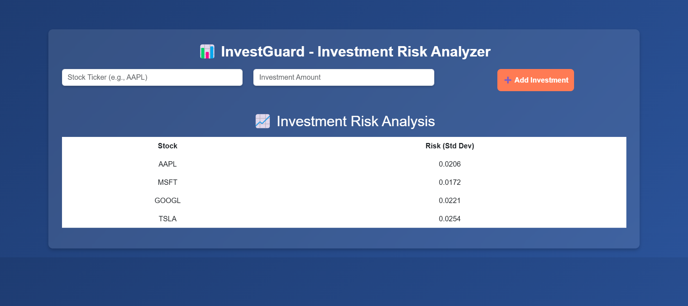

# **InvestGuard – Smart Investment Risk Analysis Tool**  
📊 **Spring Boot (Java) | Portfolio Risk Calculation | Financial Technology**  

> **"Analyze investment risk and make informed financial decisions with real-time risk assessment."**  

  

---

## **📖 About InvestGuard**
**InvestGuard** is a **Spring Boot-powered investment risk analysis tool** that helps investors calculate **portfolio volatility**. Users enter stock details, and the system **computes risk metrics like standard deviation** to assess investment stability.  

### **✨ Features**
✅ **Add Investment Data** – Enter stock tickers, investment amounts, and past returns.  
✅ **Risk Calculation** – Uses **standard deviation** to measure investment volatility.  
✅ **Simple UI** – Built using **HTML, CSS, and JavaScript**, served by Spring Boot.  
✅ **REST API** – Scalable backend for risk computation.  

---

## **🛠️ Tech Stack**
### **🚀 Backend (Spring Boot)**
- **Java 17**, **Spring Boot** (REST API & Static Frontend)
- **Maven** (Dependency Management)
- **H2 Database** *(for fast and efficient storage)*
- **JUnit** *(For Testing)*

### **💻 Frontend (Served by Spring Boot)**
- **HTML, CSS, JavaScript**
- **Fetch API** *(for REST API calls)*
- **Bootstrap UI for clean design**

---

## **📸 Screenshots**
### **📊 Dashboard & Risk Analysis**


---

## **🛠️ Installation & Setup**
### **1️⃣ Clone the Repository**
```sh
git clone https://github.com/negarprh/InvestGuard.git
cd InvestGuard
```

### **2️⃣ Run the Application (Spring Boot)**
```sh
mvn clean install
mvn spring-boot:run
```
✅ **Backend & frontend will both run at:**  
📌 **`http://localhost:8080`**  

### **3️⃣ Open the Frontend**
📌 Go to:  
```sh
http://localhost:8080/index.html
```
Since the frontend is inside **Spring Boot's `static/` folder**, it's **automatically served by the backend**.

---

## **📡 API Endpoints**
### **➕ Add Investment**
```http
POST /api/add-stock?ticker=AAPL&amount=5000
```
✅ **Response**
```json
"Investment added: AAPL"
```

### **📊 Get Risk Analysis**
```http
GET /api/risk
```
✅ **Response**
```json
[
    {
        "Investment": "AAPL",
        "Risk (Std Dev)": 0.025
    },
    {
        "Investment": "MSFT",
        "Risk (Std Dev)": 0.020
    }
]
```

---

## **📝 Future Improvements**
🔹 Expand **financial risk analysis metrics** beyond standard deviation  
🔹 Store investment data in **MySQL/PostgreSQL**  
🔹 Add a **Sharpe Ratio calculator** for risk-adjusted returns  
🔹 Implement **user authentication** for secure portfolio management  

---

## **👨‍💻 Author**
**Negar** – *Backend & Frontend Developer*  
🔗 **GitHub:** [YourGitHubProfile](https://github.com/YOUR_GITHUB)  
📧 **Email:** your.email@example.com  

---

## **📜 License**
This project is **MIT Licensed** – Feel free to use and modify!  

📌 **Next Steps:**  
✅ **Commit this `README.md` to GitHub**  
✅ **Upload screenshots (`website.png` in repo)**  
✅ **Share your project on LinkedIn for visibility!**  

🚀 **Now your project is CV-ready! Let me know if you need any last-minute edits.** 🔥
