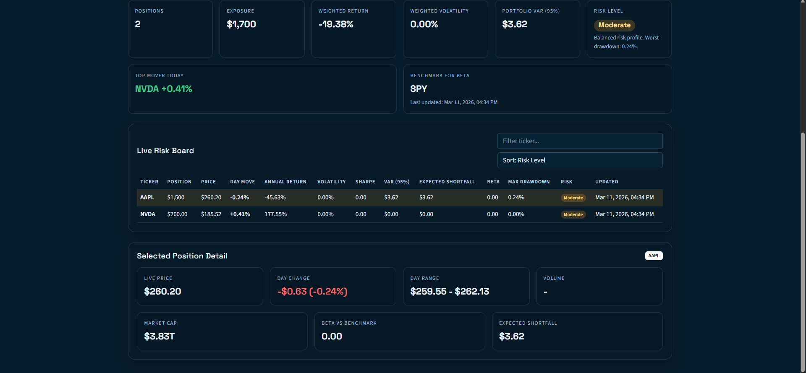

# InvestGuard - Live Investment Risk Intelligence

InvestGuard is a Spring Boot risk analytics dashboard for equity positions.  
Add a ticker and position size, and the app pulls live market data from **Finnhub** with automatic fallback to local quote history when candle access is restricted.




## Key Improvements In This Version

- Real-time quote snapshot for each position (price, day move, intraday high/low, volume, market cap)
- Advanced risk metrics:
  - Annualized return and volatility
  - Sharpe ratio
  - 95% Value at Risk (VaR)
  - 95% Expected Shortfall (CVaR)
  - Max drawdown
  - Beta vs configurable benchmark (default: `SPY`)
- Portfolio summary API backed by server-side calculations (no hardcoded client summary math)
- Live refresh endpoints for recruiter/demo-ready portfolio updates
- Upsert behavior by ticker (adding an existing ticker updates the position)
- Redesigned frontend with filtering, sorting, live risk board, and position detail panel

## Tech Stack

- Java 17, Spring Boot 3.4
- Spring Data JPA + H2
- Finnhub API
- HTML, CSS, Bootstrap 5, Vanilla JavaScript

## Run Locally

1. Clone and enter the project:
   ```bash
   git clone https://github.com/negarprh/InvestGuard.git
   cd InvestGuard
   ```
2. Start app:
   ```bash
   ./mvnw spring-boot:run
   ```
   Windows PowerShell:
   ```powershell
   .\mvnw.cmd spring-boot:run
   ```
3. Open:
   - `http://localhost:8080`

### Provider API Key

Set your Finnhub key before starting the app:

```powershell
$env:FINNHUB_API_KEY="your_finnhub_key"
```

Then run:

```powershell
.\mvnw.cmd spring-boot:run
```

If adding a stock fails with an error about Finnhub access, test your key directly:

```powershell
curl.exe --get "https://finnhub.io/api/v1/quote" --data-urlencode "symbol=AAPL" --data-urlencode "token=$env:FINNHUB_API_KEY"
curl.exe --get "https://finnhub.io/api/v1/stock/candle" --data-urlencode "symbol=AAPL" --data-urlencode "resolution=D" --data-urlencode "from=1704067200" --data-urlencode "to=1735689599" --data-urlencode "token=$env:FINNHUB_API_KEY"
```

If quote works but candle returns `{"error":"You don't have access to this resource."}`, InvestGuard now falls back automatically to quote-based local history so `/api/add-stock` still works. Metrics become more stable as more snapshots are collected over time.

## API Endpoints

| Endpoint                           | Method | Description                                                                          |
| ---------------------------------- | ------ | ------------------------------------------------------------------------------------ |
| `/api/add-stock?ticker=X&amount=Y` | `POST` | Adds or updates a position using Finnhub data and recalculates all metrics.          |
| `/api/add-manual`                  | `POST` | Manual payload support: `{ "ticker":"AAPL", "amount":5000, "pastReturns":[...] }`.   |
| `/api/risk`                        | `GET`  | Returns stored risk summaries.                                                       |
| `/api/risk/live`                   | `GET`  | Refreshes each stored ticker from live market data and returns fresh risk summaries. |
| `/api/portfolio/summary`           | `GET`  | Portfolio-level aggregate metrics from stored data.                                  |
| `/api/portfolio/summary/live`      | `GET`  | Refreshes live data then returns portfolio aggregate metrics.                        |
| `/api/investments`                 | `GET`  | Raw persisted entities, including stored returns.                                    |

## How Risk Is Calculated

For each ticker, the backend builds daily returns from close prices:

`dailyReturn_t = (price_t - price_(t-1)) / price_(t-1)`

Then it computes:

- Annualized return: `(1 + meanDailyReturn) ^ tradingDaysPerYear - 1`
- Annualized volatility: `stdDev(dailyReturns) * sqrt(tradingDaysPerYear)`
- Sharpe ratio: `(annualizedReturn - riskFreeRate) / annualizedVolatility`
- Value at Risk (VaR): absolute loss at configured percentile (default 5%)
- Expected Shortfall (CVaR): average of tail losses up to that percentile
- Max drawdown: maximum peak-to-trough decline on the equity curve
- Beta vs benchmark: `cov(stockReturns, benchmarkReturns) / var(benchmarkReturns)` using overlapping dates

Risk level classification:

- `Low`: low volatility + low drawdown + Sharpe above threshold
- `Moderate`: below moderate volatility/drawdown thresholds
- `High`: otherwise

Portfolio summary:

- Exposure-weighted average return/volatility/Sharpe
- Total VaR = sum of position VaR
- Worst drawdown = max drawdown among positions

Data source behavior:

- Primary: Finnhub candle + quote endpoints
- Fallback: if candle access is denied, app stores daily quote snapshots locally and computes risk from this accumulating local history

## Risk Configuration (No Hardcoded Constants)

Risk parameters are now configurable in [`src/main/resources/application.yml`](/e:/Categories/Coding/InvestGuard/InvestGuard/src/main/resources/application.yml):

- `investguard.risk.risk-free-rate`
- `investguard.risk.var-percentile`
- `investguard.risk.trading-days-per-year`
- `investguard.risk.benchmark-ticker`
- volatility/drawdown/Sharpe thresholds for risk classification

All can be overridden with environment variables, for example:

```bash
INVESTGUARD_RISK_FREE_RATE=0.03
INVESTGUARD_BENCHMARK_TICKER=QQQ
```

## Notes

- Data provider availability and symbol support depend on Finnhub responses.
- H2 DB persists locally at `./data/investguard`.
- H2 console is enabled at `http://localhost:8080/h2-console`.

## Build & Test

```bash
./mvnw clean test
```
