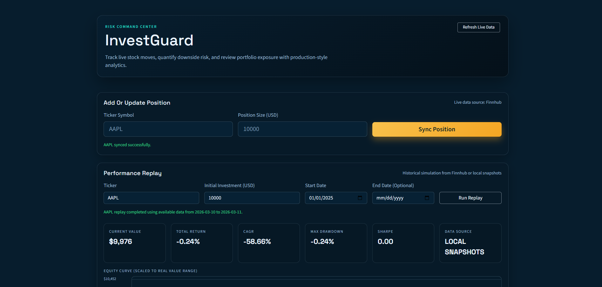
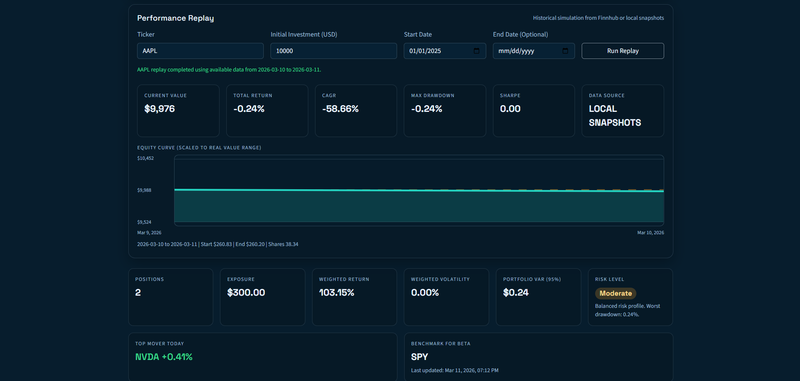
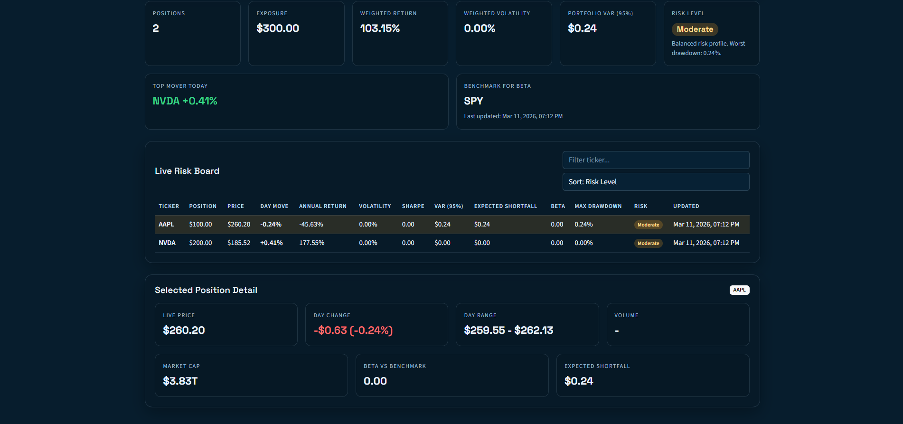

# InvestGuard – Portfolio Risk Intelligence Platform

InvestGuard is a **backend-driven portfolio risk analytics platform** built with Spring Boot.
It ingests live market data, computes advanced financial risk metrics, and provides **historical portfolio simulation (backtesting)** to evaluate investment strategies over time.

The application demonstrates **real-world backend engineering challenges** including:

- external financial data ingestion
- time-series analytics
- portfolio risk modeling
- configurable risk engines
- fallback data pipelines
- REST API design for financial analytics

---

## Key Capabilities

### Real-Time Market Data

Fetch live quotes from the Finnhub API and synchronize portfolio positions automatically.

Displayed metrics include:

- current price
- daily change
- intraday range
- volume
- market capitalization

If candle data is unavailable due to API plan limits, the system automatically **falls back to locally stored quote snapshots**, allowing risk metrics and backtests to continue functioning.

---

### Advanced Portfolio Risk Analytics

InvestGuard calculates institutional-style risk metrics for each position:

- Annualized return
- Annualized volatility
- Sharpe ratio
- Value at Risk (VaR 95%)
- Expected Shortfall (CVaR 95%)
- Maximum drawdown
- Beta vs configurable benchmark (default SPY)

Risk levels are automatically classified based on volatility, drawdown, and Sharpe thresholds.

---

### Portfolio Aggregation Engine

Portfolio-wide metrics are calculated **server-side** to ensure consistency and avoid client-side approximation.

The API provides:

- exposure weighted returns
- portfolio volatility
- aggregate VaR
- worst drawdown across positions

---

### Historical Performance Replay (Backtesting)

The **Performance Replay** engine simulates how an investment would have performed over time.

Users can select:

- ticker
- investment amount
- start date
- optional end date

The backend reconstructs portfolio performance using historical price data.

Simulation results include:

- equity curve
- cumulative return
- CAGR
- volatility
- Sharpe ratio
- VaR and CVaR
- maximum drawdown

This feature transforms the project from a simple dashboard into a **mini portfolio analytics platform**.

---

## Screenshots







---

## Architecture Overview

```
Client Dashboard
        │
        ▼
Spring Boot REST API
        │
        ├── Portfolio Risk Engine
        │
        ├── Market Data Service
        │       └── Finnhub API
        │
        └── Persistence Layer
                └── H2 Database (local snapshots)
```

The system is designed with clear separation between:

- data ingestion
- risk computation
- persistence
- API delivery

---

## Tech Stack

Backend

- Java 17
- Spring Boot 3
- Spring Data JPA

Data

- Finnhub Market Data API
- H2 Embedded Database

Frontend

- HTML
- CSS
- Bootstrap 5
- Vanilla JavaScript

Infrastructure

- Maven build system
- REST API architecture

---

## API Endpoints

| Endpoint                           | Method | Description                             |
| ---------------------------------- | ------ | --------------------------------------- |
| `/api/add-stock?ticker=X&amount=Y` | POST   | Adds or updates a portfolio position    |
| `/api/add-manual`                  | POST   | Adds manual position data               |
| `/api/risk`                        | GET    | Returns stored risk metrics             |
| `/api/risk/live`                   | GET    | Refreshes metrics with live market data |
| `/api/portfolio/summary`           | GET    | Portfolio-wide analytics                |
| `/api/portfolio/summary/live`      | GET    | Portfolio analytics with live refresh   |
| `/api/portfolio/backtest`          | POST   | Runs historical investment simulation   |
| `/api/investments`                 | GET    | Returns raw stored portfolio data       |

---

## Example Backtest Request

```
POST /api/portfolio/backtest
```

```
{
  "ticker": "AAPL",
  "amount": 10000,
  "startDate": "2024-01-01",
  "endDate": "2025-12-31"
}
```

Response includes:

- portfolio equity curve
- cumulative return
- CAGR
- volatility
- Sharpe ratio
- Value at Risk
- Expected Shortfall
- maximum drawdown
- beta vs benchmark

---

## Risk Calculation Model

Daily returns are calculated as:

```
dailyReturn_t = (price_t - price_(t-1)) / price_(t-1)
```

Metrics derived from daily returns:

Annualized Return

```
(1 + meanDailyReturn) ^ tradingDaysPerYear - 1
```

Annualized Volatility

```
stdDev(dailyReturns) * sqrt(tradingDaysPerYear)
```

Sharpe Ratio

```
(annualizedReturn - riskFreeRate) / annualizedVolatility
```

Additional metrics include:

- Value at Risk
- Expected Shortfall
- Maximum Drawdown
- Beta vs benchmark

---

## Data Source Strategy

Primary source

- Finnhub candle and quote APIs

Fallback strategy

If candle access is restricted:

- daily quote snapshots are stored locally
- historical simulations use accumulated local history
- risk metrics remain functional

This ensures the application continues to operate even with limited API access.

---

## Configuration

Risk parameters are fully configurable via `application.yml`.

Example settings:

- risk free rate
- VaR percentile
- trading days per year
- benchmark ticker
- volatility thresholds

Environment variables can override configuration values.

---

## Running Locally

Clone the repository:

```
git clone https://github.com/negarprh/InvestGuard.git
cd InvestGuard
```

Run the application:

```
./mvnw spring-boot:run
```

Open in browser:

```
http://localhost:8080
```

---

## Why This Project Exists

InvestGuard was built to explore **backend financial analytics engineering** including:

- portfolio risk modeling
- financial time-series processing
- REST API design
- external data integration
- investment performance simulation

---
